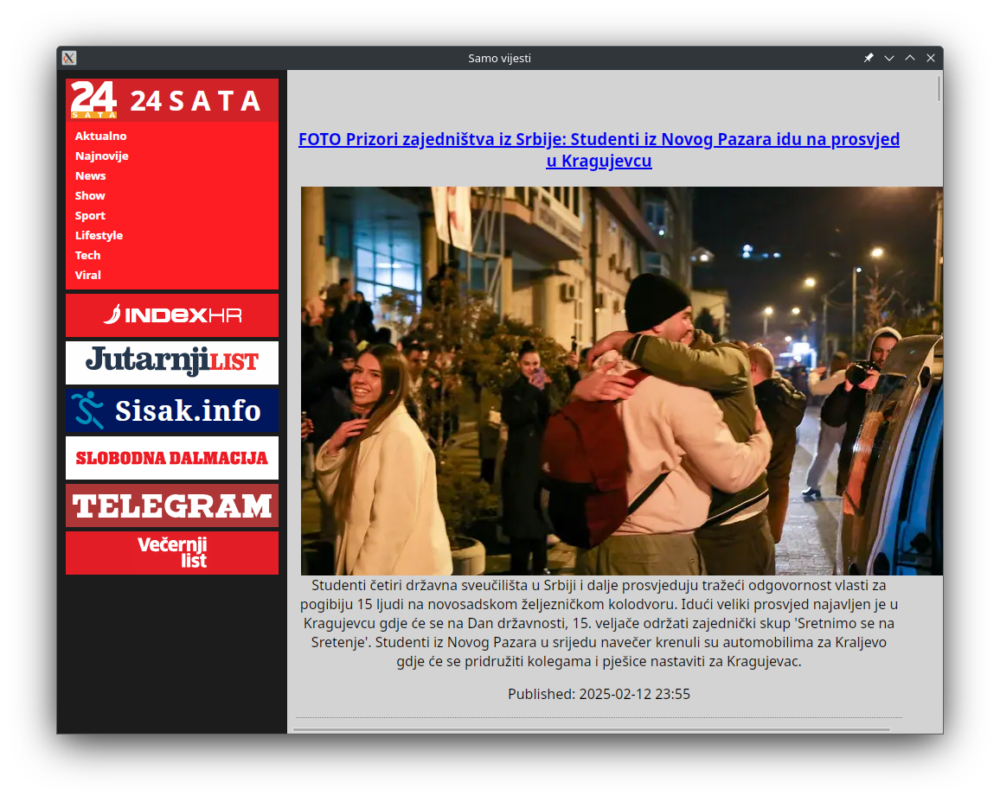

# Samo vijesti

This app downloads RSS feeds of a few news sites and displays them in a concise way without boilerplate.

# Developing

Requires go, npm and wails

`wails dev` to run

## Short term goals
- Basic app functionality, hardcoding is fine
- Learning how various sites function so filtering can be automated in the future
- Learning Go, JS and wails

## Mid term goals
- Remove hardcoding and allow for configurable RSS fetching and site filtering
- Consider mobile ports and different tools if needed
- Add persistent configuration
- Local caching
- Archiving

## Long term goals
- Sync across devices (serverless)
- Have a large library of sites users can select, as well as add their own